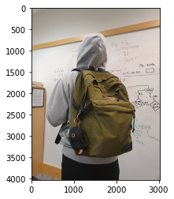

# Backend APIs & AI Program
- Our program provides two APIs: 
    1. found item API (for F-users)
    2. lost item API  (for L-users)

- Both APIs have similar flow as follows:
    1. When F-user (L-user) requests to the backend server's found (lost) item API, the server proccess the following classifications.
        1. Query the MySQL Database that matches the object's name and category
        2. With the data, we calculate the similarity of date and location

# Image Recognition Program
- This program will be used as the final classification for our system. 
- Input: 
    1. image file
- Output:
    1. Label of the object in the image
    2. Specific description of the object such as color

Final outputs will be stored in the database, and it will be used to compare with the description that lost users provides to us. If the description obtained from the image of found user and the description provided from lost user is similar enough, our server will connect the users. 

- You can try yourself by following 5 steps:

1. Install following libs:
    - pip install opencv-python
    - pip install matplotlib
    - pip install colorthief
    - pip install webcolors


```python
import cv2
```


```python
import matplotlib.pyplot as plt
```


```python
from colorthief import ColorThief
```


```python
import webcolors
```


```python
from scipy.spatial import KDTree
```

2. Put your absolute path of currenct directory


```python
absolute_path = ''
```

3. Download, Unzip, and relocate the files
    - Download the "MobileNet-SSD v3" zip files from following link: https://github.com/opencv/opencv/wiki/TensorFlow-Object-Detection-API
    - Unzip both "weights" and "config" files, and paste the following files to the same location of this file


```python
config_file = absolute_path + 'ssd_mobilenet_v3_large_coco_2020_01_14.pbtxt'
frozen_model = absolute_path + 'frozen_inference_graph.pb'
```


```python
model = cv2.dnn_DetectionModel(frozen_model,config_file)
```

4. Import and copy the labels as follows:
    - Copy the labels from the following link: https://github.com/pjreddie/darknet/blob/master/data/coco.names
    - Paste them in a new file name "Labels"


```python
classLabels = []
file_name = absolute_path + 'Labels'
with open(file_name, 'rt') as fpt:
    classLabels = fpt.read().rstrip('\n').split('\n')
```


```python
# There are total of 80 labels supported from this 
print(classLabels)
```

    ['person', 'bicycle', 'car', 'motorbike', 'aeroplane', 'bus', 'train', 'truck', 'boat', 'traffic light', 'fire hydrant', 'stop sign', 'parking meter', 'bench', 'bird', 'cat', 'dog', 'horse', 'sheep', 'cow', 'elephant', 'bear', 'zebra', 'giraffe', 'backpack', 'umbrella', 'handbag', 'tie', 'suitcase', 'frisbee', 'skis', 'snowboard', 'sports ball', 'kite', 'baseball bat', 'baseball glove', 'skateboard', 'surfboard', 'tennis racket', 'bottle', 'wine glass', 'cup', 'fork', 'knife', 'spoon', 'bowl', 'banana', 'apple', 'sandwich', 'orange', 'broccoli', 'carrot', 'hot dog', 'pizza', 'donut', 'cake', 'chair', 'sofa', 'pottedplant', 'bed', 'diningtable', 'toilet', 'tvmonitor', 'laptop', 'mouse', 'remote', 'keyboard', 'cell phone', 'microwave', 'oven', 'toaster', 'sink', 'refrigerator', 'book', 'clock', 'vase', 'scissors', 'teddy bear', 'hair drier', 'toothbrush']


```python
model.setInputSize(320, 320)
model.setInputScale(1.0/127.5)
model.setInputMean((127.5, 127.5, 127.5))
model.setInputSwapRB(True)
```


    < cv2.dnn.Model 0x7ff04077ebf0>


5. Try with your owm image that contains object with one of the labels above


```python
img_file = 'image2.jpeg'

img = cv2.imread(absolute_path + img_file)
```


```python
plt.imshow(img)
plt.imshow(cv2.cvtColor(img, cv2.COLOR_BGR2RGB))
```


    <matplotlib.image.AxesImage at 0x7ff040794340>


    

    


```python
ClassIndex, confidence, bbox = model.detect(img, confThreshold=0.5)
```


```python
print(ClassIndex)
if (len(ClassIndex)>0):
    for idx in ClassIndex:
        if idx > 80:
            continue
        else:
            print(classLabels[idx-1])
```

    [ 1 27]
    person
    handbag


```python
# This function converts rgb 3-tuples to name of closest color
def convert_rgb_to_names(rgb_tuple):
    css3_db = webcolors.CSS3_HEX_TO_NAMES
    names = []
    rgb_values = []
    for color_hex, color_name in css3_db.items():
        names.append(color_name)
        rgb_values.append(webcolors.hex_to_rgb(color_hex))
    
    kdt_db = KDTree(rgb_values)
    distance, index = kdt_db.query(rgb_tuple)
    return names[index]
```


```python
font_scale = 3
font = cv2.FONT_HERSHEY_PLAIN
for ClassInd, conf, boxes in zip(ClassIndex.flatten(), confidence.flatten(), bbox):
    prefix, ext = img_file.split('.')
    filename = absolute_path + prefix + classLabels[ClassInd-1] + '.' + ext
    cv2.imwrite(filename, img[boxes[1]: boxes[1]+boxes[3], boxes[0]:boxes[0]+boxes[2]])
    color_thief = ColorThief(filename)
    dominant_color = color_thief.get_color(quality=1)
    print(convert_rgb_to_names(dominant_color), classLabels[ClassInd-1])
```

    darkslategray person
    darkslategray handbag

